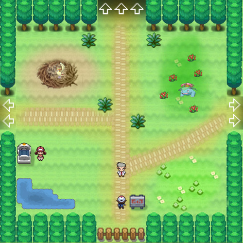
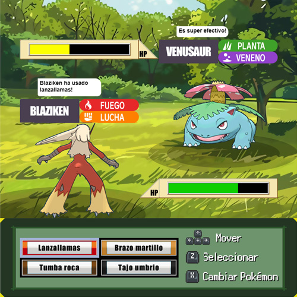

# Pokemon Safari Zone

## Equipo
Grupo KBT-11220

## Participantes
- Ianigro, Hernán Andrés
- Avalos, Lucas Martin
- Adam, Johann Gustavo
- Ciani, Alejandro Nahuel
- Martinez, Germán Nicolás

## Capturas de pantalla

## Cómo jugar
¡Bienvenido a la Zona Safari, un lugar lleno de extraños Pokemon! Al iniciar el juego, nos convertimos en un entrenador Pokemon, al que movemos con las flechas direccionales. Con la tecla "Z" interactuamos con el individuo que estemos mirando. El personaje de cabello rosa es la enfermera Joy, encargada de curar a nuestros Pokemon cuando estos se debilitan tras un combate, y el más cercano a nosotros es el profesor Oak, encargado de darnos nuestro equipo de tres Pokemon iniciales. Dentro de la zona nos vamos a encontrar diferentes tipo de Pokemon salvajes, los cuales hay que combatir y derrotar. La dificultad de cada uno varía con sus tipos y debilidades, además, hay un Pokemon legendario llamado Kyurem. ¡El más fuerte de todos!
Al entrar en batalla, cada Pokemon tiene 4 ataques a elegir (dos de su tipo primario y dos de su tipo secundario), el color de sus bordes indica su tipo. Para seleccionar el ataque usamos las flechas direccionales y lo seleccionamos con "Z". Cada ataque tiene su precisión, por lo que a veces pueden fallar. Trata de explotar las vulnerabilidades de cada tipo.

### Controles:
- Presiona ENTER para comenzar.
- Para salir de la pantalla de instrucciones, presiona SPACE.
- Las flechas arriba, abajo, izquierda y derecha mueven al personaje.
- El botón Z sirve para interactuar con los demás personajes y para aceptar las opciones.
- (En batalla) El botón X sirve para cambiar el Pokémon utilizado por otro.

### Resultados de una batalla:
- Que todos nuestros Pokemon se debiliten, por lo que nosotros perdemos y debemos ir a curarlos para volver a jugar una revancha.
- Que el Pokemon rival se debilite, por lo que el rival pierde. Al interactuar con los rivales derrotados estos son "capturados" y añadidos al equipo (exceptuando los Pokemon legendarios).

### Tabla de ventajas y debilidades
Normal
- debilidades: lucha 
- inmunidades: fantasma

Lucha
- debilidades: volador, psiquico, hada
- resistencias: roca, bicho, oscuro

Volador
- debilidades: roca, electrico, hielo
- resistencias: lucha, bicho, planta
- inmunidades: suelo

Veneno
- debilidades: suelo, psiquico
- resistencias: lucha, veneno, bicho, planta, hada

Suelo
- debilidades: agua, planta, hielo
- resistencias: veneno, roca
- inmunidades: electrico

Roca
- debilidades: lucha, acero, agua, planta
- resistencias: normal, volador, veneno, fuego

Bicho
- debilidades: volador, roca, fuego
- resistencias: lucha, suelo, planta

Fantasma
- debilidades: fantasma, oscuro
- resistencias: veneno, bicho
- inmunidades: normal, lucha

Acero
- debilidades: lucha, suelo, fuego
- resistencias: normal, lucha, roca, bicho, acero, planta, psiquico, hielo, dragon, hada
- inmunidades: veneno

Fuego
- debilidades: suelo, roca, agua
- resistencias: bicho, acero, fuego, planta, hielo, hada

Agua
- debilidades: planta, electrico
- resistencias: acero, fuego, agua, hielo

Planta
- debilidades: volador, veneno, bicho, fuego, hielo
- resistencias: suelo, agua, planta, electrico

Electrico
- debilidades: suelo
- resistencias: volador, acero, electrico

Psiquico
- debilidades: bicho, fantasma, oscuro
- resistencias: lucha, psiquico

Hielo
- debilidades: lucha, roca, acero, fuego
- resistencias: hielo

Dragon
- debilidades: hielo, dragon, hada
- resistencias: fuego, agua, planta, electrico

Oscuro
- debilidades: lucha, bicho, hada
- resistencias: fantasma, oscuro
- inmunidades: psiquico

Hada
- debilidades: veneno, acero
- resistencias: lucha, bicho, oscuro
- inmunidades: dragon

### Stats:
- Puntos de vida (hp): La cantidad de vida del Pokemon, que disminuye con cada ataque. Al llegar a 0, el pokemon ya no puede continuar peleando.
- Ataque (atk): Determina el daño de los ataques (Cuchillada, Megacuerno, etc).
- Defensa (def): Determina la capacidad de cada Pokemon para defenderse de ataques.
